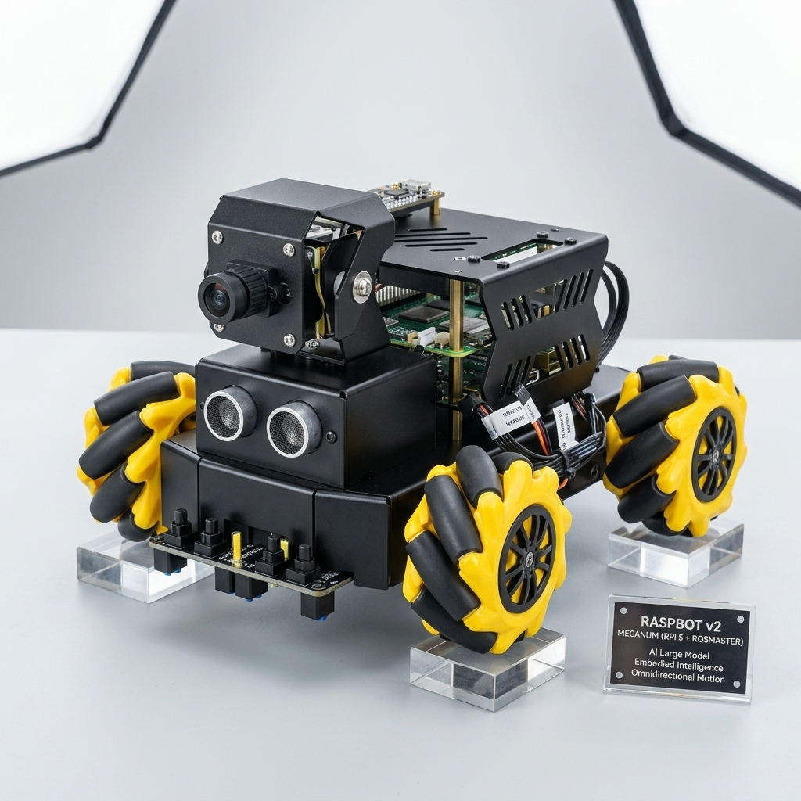

# Yahboom Raspbot v2 (Boomy) - MCP Server, Webapp & Documentation

## Overview

**Boomy** is a **Yahboom Raspbot v2** (Mecanum Version) robot car. Weighing in at approximately **1.0 kg** and costing roughly **$300** (fully loaded with a Raspberry Pi 5 16GB), it provides a unified platform for testing sensor integration, ROS 2 orchestration, and agentic (AI-driven) robotics. It's also great fun for kids of all ages.

### The Manufacturer: Yahboom
[Yahboom](https://www.yahboom.net/) is a prominent player in the Chinese robotics and STEM education industry. They offer a diverse range of hardware platforms:
*   **Market Range**: From entry-level $50 DIY kits to advanced $2,000+ STEM robots with precision mechanical arms.
*   **Industry Position**: They specialize in accessible hardware for education and prototyping, positioned below enterprise-grade platforms such as Unitree or Noetix.
*   **Developer Ecosystem**: Yahboom maintains a strong commitment to a **FOSS (Free and Open Source Software)** stack and provides active GitHub support for developers.

---

## 🏗️ Hardware Architecture

Boomy utilizes a "Double-Stack" controller model to bridge real-time physical reliability with high-level cognitive tasks:

1.  **Rosmaster (ESP32 / Micro-ROS)**: Small-form-factor hardware controller for low-latency motor control, ultrasonic pinging, and line-sensor processing.
2.  **Raspberry Pi 5 (Optional / Gateway)**: The main brain for standalone operation.

### 🚀 The "Zero-Host" Swarm Config
For scaled deployments, Boomy can operate in a **Pi-less Swarm** mode:
- **Setup**: Remove the Raspberry Pi; replace with a WiFi-to-Ethernet/UART bridge ($15).
- **Control**: Centralized orchestration via a remote **Mothership** (PC with RTX 4090).
- **Scaling**: Deploy 3+ units for the price of a single Pi-hosted robot.

---

## 🕹️ Interface Separation

This project clearly distinguishes between human-operable controls and machine-optimized interfaces:

*   **Human Interface**: A browser-based **Web Dashboard** (React/Vite) designed for manual telemetry observation, peripheral control (lights, OLED), and human-robot interaction.
*   **Machine Interface**: A standards-compliant **MCP Server** (Model Context Protocol) designed for AI agents and MCP clients to programmatic control Boomy as a tool within a larger fleet.

---

## 📂 Documentation Pillars

| Pillar | Focus | Key Topics |
| :--- | :--- | :--- |
| **[Setup & Installation](docs/ops/installation.md)** | Start Here | Launch commands, `uv run` usage, and baseline configuration. |
| **[Software & Logic](docs/core/)** | Architecture | System design, ROS 2 node graphs, and state management. |
| **[Hardware & Pinouts](docs/hardware/)** | Physical Layer | Wiring diagrams, I2C addresses, and sensor technical specs. |
| **[ROS 2 Bridge](docs/hardware/ROSBRIDGE.md)** | Connectivity | Bridge architecture, topic map, state cache, env vars, known bugs. |
| **[Voice & Audio](docs/hardware/VOICE_AUDIO.md)** | Sound System | CSK4002 module protocol, espeak-ng TTS, chatrobot architecture. |
| **[Multi-Robot Integration](docs/fleet/)** | Ecosystem | Federated fleet standards and cross-robot communication protocols. |

---

*Historical status logs and legacy research are preserved in the [docs/archive/](docs/archive/) directory.*
