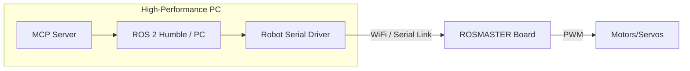

# Pi-less Setup Guide: PC-as-Brain Architecture

This guide details how to operate the Yahboom G1 hardware by bypassing the Raspberry Pi 5 and using a central PC for all ROS 2 compute.

## 1. The Core Dilemma: Autonomy vs. Power

### Local Brain (RPi 5)
- **Use Case**: Truly autonomous "Coffee Shop" demos where the robot moves without an external PC.
- **Pros**: Zero-latency local loops, portable, independent.
- **Cons**: Limited compute for heavy AI/Vision models, extra cost per robot (~$100).

### Central Brain (PC)
- **Use Case**: Fleet operations, heavy LLM processing, or cost-optimized hardware clusters.
- **Pros**: Massive compute power, single point of update for all robots, reduced per-unit cost.
- **Cons**: Dependent on a stable wireless link, limited local autonomy (fails if WiFi drops).

## 2. Hardware bridging (The WiFi Problem)

To control the robot without a Pi, you need a way to send serial commands from your PC over the air to the ROSMASTER controller board.

### Option A: WiFi-to-Serial Bridge (ESP32)
1.  **Hardware**: Attach an **ESP32** or **ESP8264** (~$5) to the board's serial header.
2.  **Firmware**: Flash it with a "Transparent Serial Bridge" (like `esp-link`).
3.  **Operation**: Your PC connects to the ESP32's IP, and any data sent via TCP/UDP is output as serial commands to the robot.

### Option B: Tethered USB (Development Mode)
1.  **Hardware**: Connect a long USB cable (or active USB extension) directly from your PC to the ROSMASTER board's Type-C/Micro-USB port.
2.  **Operation**: The PC sees the robot as a COM port (`/dev/ttyUSB0` or `COM3`).

## 3. Software Architecture (PC-Side)

In this mode, your PC does everything. The robot is just a "dumb" actuator.

## 4. Limitations (The "Eyes" Problem)

Without the Raspberry Pi, you lose the native CSI/USB camera processing.

| Feature | Pi-less | Alternative |
| :--- | :---: | :--- |
| **Motion** | ✅ | Direct serial commands (Twist). |
| **Telemetry** | ✅ | Read IMU/Battery via serial response. |
| **Camera** | ❌ | Requires an IP Camera or an ESP32-CAM (low res). |
| **Lidar** | ❌ | Requires raw Lidar-to-Ethernet bridge (expensive). |

## 5. Conclusion: When to go Pi-less?

Go **Pi-less** if you are building a fleet of robots that primarily perform tasks in a single room with strong WiFi, and you prefer to maintain one powerful server rather than 10 small ones. 

Keep the **Pi** for any robot that needs to be "mission critical" or truly mobile (like the Coffee Shop Scout).
