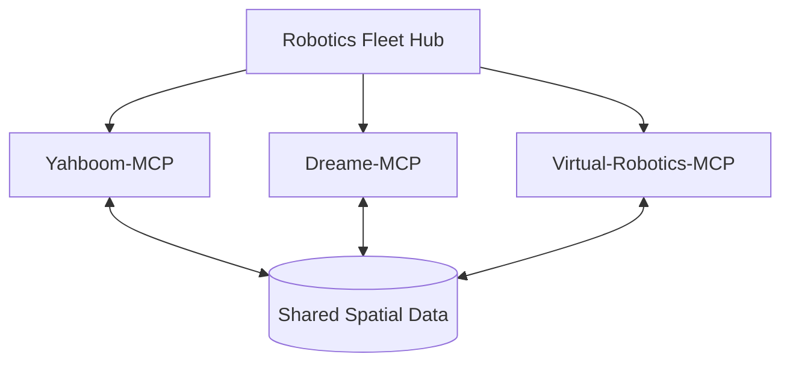

# Architecture: Federated Robotics Fleet

## 1. Modular Specialization

Instead of a single "God MCP" for all robots, we use a federated architecture where each robot or platform has its own dedicated MCP server.

## 2. Shared Spatial Data (LIDAR/SLAM)

Spatial data is stored in a standardized format and accessible by all fleet members.
- **Maps**: OBJ, PLY, and GeoJSON formats.
- **Synchronization**: Real-time position updates via OSC or WebSocket.

## 3. Fleet Discovery

MCP servers identify each other using the `fleet-registry.json` located in `mcp-central-docs`. This allows for dynamic cross-server tool calling.

## 4. Agentic Orchestration

We leverage LLM sampling to coordinate complex tasks:
1. **Goal**: "Map the entire first floor."
2. **Orchestrator**: Identifies Dreame for floorspace and Yahboom for table-height details.
3. **Execution**: Both robots are dispatched and results are merged.
