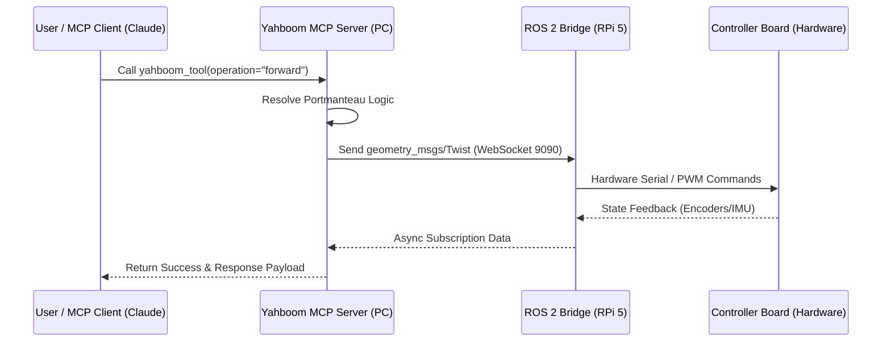
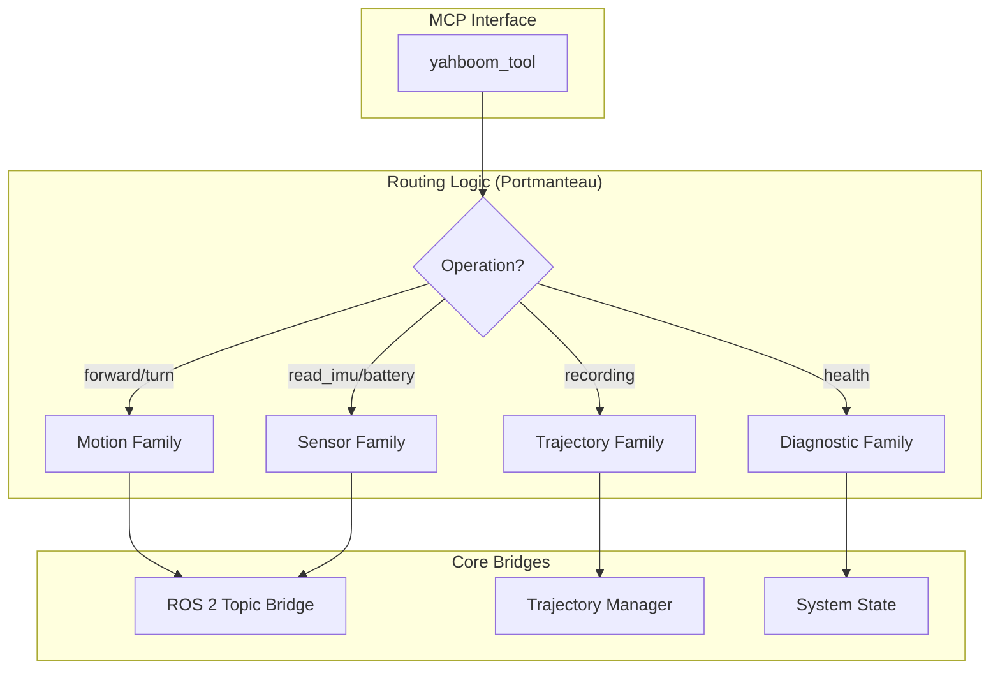

# Yahboom ROS 2 MCP - Architecture & Connection Guide

This document details the industrial-grade architecture of the Yahboom G1 ROS 2 MCP ecosystem, focusing on the communication flow, the Portmanteau pattern, and tool distribution.

## 1. System Architecture

The ecosystem uses a **Distributed Bridge Pattern**. The MCP server lives on the developer's PC and interacts with the robot's ROS 2 stack over the network.

## 2. The Portmanteau Pattern

To prevent "tool explosion" and ensure a clean agentic interface, we use the **Portmanteau Pattern**. All high-level robotics operations are consolidated into a single, context-aware tool: `yahboom_tool`.

### Why Portmanteau?
1.  **Context Density**: Keeps the tool registry small, allowing LLMs to hold the entire capability set in their active context.
2.  **Dynamic Routing**: Enables the server to handle complex imports and dependency management internally.
3.  **Atomic Orchestration**: Ensures that related operations (e.g., motion + sensor feedback) follow a unified execution pipeline.

## 3. Tool Reference

| Family | Operations | Parameters | Description |
| :--- | :--- | :--- | :--- |
| **Motion** | `forward`, `backward`, `turn_left`, `turn_right`, `stop` | `param1` (Speed/Duration) | Trajectory-aware motion control. |
| **Sensors** | `read_imu`, `read_encoders`, `read_battery` | - | Real-time telemetry feedback. |
| **Trajectory**| `start_recording`, `stop_recording`, `list_trajectories` | `param1` (Name) | Lifecycle management for path capture. |
| **Diagnostic**| `health_check`, `config_show` | - | System integrity and configuration audit. |

## 4. Hardware Interaction

- **Communication**: WebSocket via `rosbridge_suite` on Port **9090**.
- **Real-time**: High-frequency telemetry (IMU/Odom) is cached in the MCP server's global state to ensure zero-latency tool responses during agentic reasoning.
- **Safety**: The server implements a **Degraded Mode** (Mocking) if the ROSBridge connection is lost, allowing for simulation and workflow testing without active hardware.

## 5. Pi-less Operation (Bypassing the Brain)

While this MCP server is optimized for the Raspberry Pi 5 / ROS 2 stack, the hardware itself allows for "Pi-less" operation in specific scenarios:

| Feature | Pi-less (Board Only) | Why? |
| :--- | :---: | :--- |
| **Basic Movement** | ✅ | The ROSMASTER board handles PWM motor control directly via serial commands. |
| **Sensor Data** | ✅ | IMU and battery voltage are readable directly from the board's co-processor. |
| **Camera Streaming**| ❌ | **RPi Required.** The camera uses the Pi's CSI/USB bus and needs high-bandwidth H.264/MJPEG encoding. |
| **Lidar/SLAM** | ❌ | **RPi Required.** Lidar data processing and map building require the ROS 2 workspace. |
| **MCP Integration** | ❌ | **RPi Required.** The current server architecture depends on the **ROSBridge WebSocket** hosted on the Pi. |

> [!NOTE]
> To control the bot without the Pi, you would need to connect your PC directly to the ROSMASTER board's micro-USB/Type-C serial port and use a standard serial driver (bypass this MCP server).

## 6. Lean Fleet Strategy (PC-as-Brain)

If you are considering a fleet of 5+ robots, the Raspberry Pi 5 cost (~$100 each) becomes significant. 

### Is the Pi superfluous?
**Technically: Yes.** If your PC is powerful enough to run multiple ROS 2 instances, it can handle the "heavy lifting" (SLAM, Navigation, Vision Processing).

### The "Wireless Uplink" Bottleneck
The real reason the Pi is included in the G1 is **Connectivity**, not just Compute. If you remove the Pi, you encounter the following challenges:

1.  **Serial-over-WiFi**: You would need an alternative wireless link (e.g., an ESP32 or a WiFi-to-Serial bridge) to send commands from your PC to the ROSMASTER board.
2.  **The Video Problem**: Streaming high-resolution camera data wirelessly directly from a sensor to a PC is difficult without an application processor (like the Pi) to handle compression (MJPEG/H.264).
3.  **Lidar Data**: Lidar generates a high-bandwidth point cloud that requires a stable, high-speed uplink.

### Optimal Scalability Design
For a cost-optimized fleet, a **Hybrid Architecture** is recommended:
- **Navigation/Control**: PC-run ROS 2 nodes talking to "dumb" robots via ESP32 WiFi bridges.
- **Vision/Lidar Nodes**: 1-2 specialized robots equipped with Pis to act as "Scouts" or "Eyes" for the rest of the fleet.
- **Stationary Workers**: Bypassing the Pi entirely by tethering the ROSMASTER board to a central server via long USB cables in a warehouse/testing scenario.
