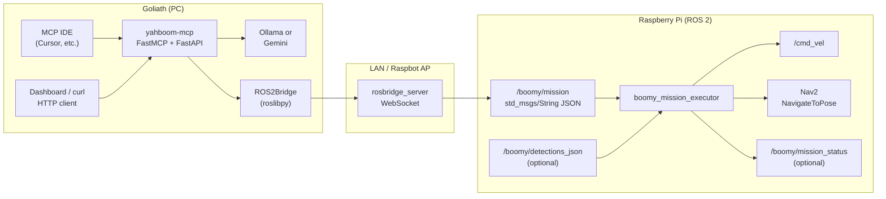

# Agent missions: LLM planner, HTTP, MCP, and Pi-side execution

**Scope:** Natural-language goals (for example, “find Benny”, “search the room for a dog”, “go to the kitchen waypoint”) are turned into a **structured mission JSON** on **Goliath** (where **yahboom-mcp** runs). That JSON can be published over **rosbridge** to the Raspberry Pi so **boomy_mission_executor** drives motion, optional **Nav2**, and optional **vision label matching**.

**Canonical copy:** `yahboom-mcp/docs/ops/AGENT_MISSION_AND_MCP.md`. **Fleet full-text copy (MCP Central Docs):** `mcp-central-docs/docs/robotics/yahboom/AGENT_MISSION_AND_MCP.md` — update both when contracts or env vars change (same rule as **`STARTUP_AND_BRINGUP.md`** / **`STACK_HEALTH_PROBE.md`**).

---

## 1. End-to-end data flow



1. **Planner** (`src/yahboom_mcp/agent_mission.py`): system prompt constrains the model to emit **one JSON object** (`MissionPlanV1` after validation).
2. **Transport to the robot:** `ROS2Bridge.publish_mission_json` publishes **`std_msgs/String`** whose **`data`** field is that JSON string. Topic name comes from **`YAHBOOM_MISSION_TOPIC`** (default **`/boomy/mission`**).
3. **Executor** (`ros2/boomy_mission_executor`): subscribes to the mission topic, parses JSON, runs **search** patterns on **`/cmd_vel`**, optionally matches **detector JSON**, optionally sends **Nav2** goals, and can publish **status** JSON on **`/boomy/mission_status`**.

---

## 2. Two ways to invoke the same planner on Goliath

Both paths call the same implementation (**`_run_agent_mission`** in `src/yahboom_mcp/server.py`). Responses match except that HTTP failures use **4xx/5xx** status codes, while MCP always returns a **JSON object** with **`success: false`** on error.

| Path | When to use |
|------|-------------|
| **MCP tool `yahboom_agent_mission`** | **Cursor** (or any MCP client) attached to **yahboom-mcp** over **stdio** or **SSE**. The IDE model can call the tool directly. |
| **`POST /api/v1/agent/mission`** | **Webapp**, automation, or any HTTP client against the unified gateway (for example **`http://127.0.0.1:10892`** in local **dual** mode). |

### 2.1 MCP tool: `yahboom_agent_mission`

Registered in **`server.py`** next to **`yahboom_tool`**, **`yahboom_agentic_workflow`**, etc.

| Argument | Type | Default | Meaning |
|----------|------|---------|--------|
| **`goal`** | string | (required) | Natural-language mission, for example **`find Benny`**. |
| **`provider`** | string | **`auto`** | **`auto`**: use Gemini if **`YAHBOOM_GEMINI_API_KEY`** is set, otherwise Ollama. **`ollama`** / **`gemini`**: force that backend. |
| **`publish_to_ros`** | boolean | **`true`** | If **`true`**, publish the validated plan JSON to **`std_msgs/String`** on the mission topic (requires a working **ROS2Bridge**). |
| **`speak`** | boolean | **`false`** | If **`true`**, speak **`voice_feedback`** from the plan via the **voice** module (SSH path on the Pi). |

**Successful return** (same keys as HTTP 200):

- **`success`**: **`true`**
- **`provider`**: which backend produced the plan (**`ollama`** or **`gemini`**)
- **`plan`**: dict (mission JSON)
- **`published_to_ros`**: whether rosbridge publish succeeded
- **`mission_topic`**: topic name used (from env or bridge)
- **`publish_error`**: string or **`null`** if publish was skipped or failed
- **`spoke`**: whether TTS ran

**Failure return** (MCP only; no HTTP exception):

- **`success`**: **`false`**
- **`error`**: human-readable message (validation, model error, invalid JSON from model, etc.)

**Cursor setup (conceptual):** configure an MCP server entry that runs **yahboom-mcp** in **`stdio`** or connects to **`dual`** mode’s MCP transport, with the same environment variables you use for the dashboard (**`YAHBOOM_IP`**, **`YAHBOOM_BRIDGE_PORT`**, optional Gemini key). After that, prompts such as “Call **`yahboom_agent_mission`** with goal **`find Benny`** and **`publish_to_ros`** true” are valid.

Introspection: **`GET /api/capabilities`** includes a short **`agent_mission`** string naming both **MCP** and **HTTP**.

### 2.2 HTTP: `POST /api/v1/agent/mission`

**Content-Type:** `application/json`

**Body** (`AgentMissionRequest`):

```json
{
  "goal": "find Benny the dog in the room",
  "provider": "auto",
  "publish_to_ros": true,
  "speak": false
}
```

**Errors:** **`400`** for bad input (empty goal, invalid **`provider`**). **`502`** for planner failures (Ollama unreachable, Gemini API error, model output not parseable as JSON).

The **webapp** wraps this via **`postAgentMission`** in **`webapp/src/lib/api.ts`** (types include optional **`nav2_goal`** on **`MissionPlanV1`**).

**Example (PowerShell, local dual mode on port 10892):**

```powershell
$body = @{ goal = "find Benny"; provider = "auto"; publish_to_ros = $true; speak = $false } | ConvertTo-Json
Invoke-RestMethod -Uri "http://127.0.0.1:10892/api/v1/agent/mission" -Method Post -Body $body -ContentType "application/json"
```

**Example truncated success body:**

```json
{
  "success": true,
  "provider": "ollama",
  "plan": {
    "version": 1,
    "intent": "search",
    "target_description": "Benny (dog)",
    "behavior": "room_search",
    "nav2_goal": null,
    "estimated_duration_sec": 60.0
  },
  "published_to_ros": true,
  "mission_topic": "/boomy/mission",
  "publish_error": null,
  "spoke": false
}
```

---

## 3. Not the same as `yahboom_agentic_workflow`

| Feature | **`yahboom_agent_mission`** | **`yahboom_agentic_workflow`** |
|--------|-----------------------------|--------------------------------|
| **Purpose** | One-shot **embodied mission plan** (JSON) + optional **ROS publish** + optional **speak**. | **Sampling loop**: nested model calls **`get_robot_health`**, **`move_robot`**, **`read_sensors`** only. |
| **Output** | Structured **`plan`** for **`boomy_mission_executor`**. | Free-text **summary** of short motion steps. |
| **ROS mission topic** | Yes, when **`publish_to_ros`** is true. | No. |
| **Code** | **`agent_mission.py`** + **`_run_agent_mission`** | **`agentic.py`** + **`ctx.sample`** |

Use **`yahboom_agent_mission`** when you want the **same pipeline** as the dashboard’s agent mission (find / search / navigate plan → Pi). Use **`yahboom_agentic_workflow`** for quick **manual-style** sequences without the mission JSON contract.

---

## 4. Mission plan schema (`MissionPlanV1`)

Validated in **`src/yahboom_mcp/agent_mission.py`**. The LLM is instructed by **`MISSION_JSON_SYSTEM`**; fields may be extended over time.

| Field | Meaning |
|-------|--------|
| **`version`** | Schema version (currently **`1`**). |
| **`intent`** | High-level intent, for example **`search`**, **`navigate`**, **`speak`**. |
| **`target_description`** | What to find or do (used for **detector label** matching on the Pi). |
| **`behavior`** | **`room_search`**, **`spin_scan`**, **`go_to_waypoint`**, **`idle`**, etc. |
| **`nav2_goal`** | Optional dict: **`frame_id`** (or **`frame`**), **`x`**, **`y`**, **`yaw_deg`** (or **`yaw`**), optional **`behavior_tree`**. Used when **`behavior`** is **`go_to_waypoint`** and Nav2 is enabled on the executor. |
| **`suggested_ros_topics`** | Hints for operators or future tooling. |
| **`voice_feedback`** | Short phrase; spoken if **`speak`** is true. |
| **`safety_notes`** | Free text. |
| **`estimated_duration_sec`** | Search duration cap (executor clamps to its **`max_duration_sec`**). |

Invalid **`nav2_goal`** types from the model are coerced to **`null`** during validation.

---

## 5. Environment variables (Goliath)

| Variable | Role |
|----------|------|
| **`YAHBOOM_IP`** | Robot hostname or IP for rosbridge and SSH. |
| **`YAHBOOM_BRIDGE_PORT`** | Rosbridge WebSocket port (often **`9090`**). |
| **`YAHBOOM_MISSION_TOPIC`** | Override mission publish topic (must match executor **`mission_topic`**). Default **`/boomy/mission`**. |
| **`OLLAMA_BASE_URL`** | Ollama API base (default **`http://127.0.0.1:11434`**). Mission planning uses the dashboard **LLM model** from server state (**`_llm_settings`** / Settings API) as **`ollama_model`**. |
| **`YAHBOOM_GEMINI_API_KEY`** | If set, **`provider: auto`** prefers **Gemini** for mission planning. |
| **`YAHBOOM_GEMINI_MISSION_MODEL`** | Gemini model id (default **`gemini-2.0-flash`**). |

Publishing requires **`ROS2Bridge`** connected (**`YAHBOOM_CONNECTION`** default **`rosbridge`**). If the bridge is down, **`published_to_ros`** is false and **`publish_error`** explains why.

---

## 6. Pi-side: `boomy_mission_executor`

Package: **`ros2/boomy_mission_executor/`**. Build on the Pi workspace with **colcon**; run:

```bash
ros2 run boomy_mission_executor mission_executor
```

or

```bash
ros2 launch boomy_mission_executor mission_executor.launch.py
```

**Behavior summary** (see package **`README.md`** for parameters):

- **`room_search`**, **`spin_scan`**, or **`intent: search`**: timed **holonomic** motion on **`/cmd_vel`** until timeout or **label match**.
- **`go_to_waypoint`** with **`nav2_goal`** and **`use_nav2: true`**: **NavigateToPose** (requires **Nav2** stack and **`nav2_msgs`**).
- **Detections:** default subscription to **`/boomy/detections_json`** (**`std_msgs/String`**) with flexible JSON (labels extracted by **`detection_utils`**). Empty **`detections_json_topic`** disables matching.
- **Status:** JSON on **`/boomy/mission_status`** (for example **`target_found`**, **`search_timeout`**, Nav2 states).

**Operator checklist:** rosbridge must bridge the mission topic into the same ROS graph as the executor; **`YAHBOOM_MISSION_TOPIC`** on Goliath must match **`mission_topic`** on the node.

---

## 7. Detector JSON shapes (executor)

The executor normalizes labels from common wrappers (see **`detection_utils.py`**), including:

- **`{"detections": [{"label": "dog", "score": 0.9}]}`**
- **`{"objects": [{"class_name": "person"}]}`**
- **`{"results": [{"class": "german_shepherd"}]}`**
- Top-level lists of dicts with **`label`**, **`class`**, **`name`**, etc.

Matching is **token overlap** between those strings and **`target_description`** (case-insensitive, substring either way). Tune detector output or mission wording if matches are too loose or too strict.

---

## 8. Troubleshooting

| Symptom | Checks |
|---------|--------|
| **`success: true`** but **`published_to_ros: false`** | Is the dashboard server connected to the robot? **`publish_error`** from bridge (not initialized, rosbridge only, publish exception). |
| **Pi does not move** | Is **`boomy_mission_executor`** running? **`ros2 topic echo /boomy/mission`**. Does **`behavior`** / **`intent`** trigger motion (see executor README)? |
| **Nav2 never runs** | Executor **`use_nav2`** parameter, Nav2 action server name (**`nav2_action_name`**), plan includes **`nav2_goal`** and **`go_to_waypoint`**. |
| **Search never stops on “Benny”** | Detector publishing to **`detections_json_topic`**? JSON includes labels the tokenizer can relate to **`target_description`**? |
| **MCP returns planner error** | Ollama up and model selected? Gemini key and quota? Model output must be **one JSON object** (no markdown fences); **`extract_json_object`** strips common fences. |
| **HTTP 502 vs MCP `success: false`** | Same underlying failure; HTTP uses status code, MCP returns a dict. |

---

## 9. Source reference index

| Artifact | Path |
|----------|------|
| Planner prompt + validation | `src/yahboom_mcp/agent_mission.py` |
| HTTP route + MCP tool + shared runner | `src/yahboom_mcp/server.py` (`AgentMissionRequest`, `_run_agent_mission`, `yahboom_agent_mission`, `agent_mission_plan`) |
| Rosbridge publish | `src/yahboom_mcp/core/ros2_bridge.py` (`publish_mission_json`, `mission_topic_name`) |
| Primitive sampling workflow (different feature) | `src/yahboom_mcp/agentic.py` |
| Executor node | `ros2/boomy_mission_executor/boomy_mission_executor/mission_executor_node.py` |
| Label parsing | `ros2/boomy_mission_executor/boomy_mission_executor/detection_utils.py` |
| Web client types + API | `webapp/src/lib/api.ts` |
| Unit tests (planner + labels) | `tests/unit/test_agent_mission.py`, `tests/unit/test_detection_utils.py` |

---

## 10. Related docs

- **[STARTUP_AND_BRINGUP.md](STARTUP_AND_BRINGUP.md)** — Boot order, rosbridge, where **`POST /api/v1/agent/mission`** fits in operator workflows (§4).
- **[STACK_HEALTH_PROBE.md](STACK_HEALTH_PROBE.md)** — Short cross-reference to agent missions and executor.
- **`ros2/boomy_mission_executor/README.md`** — Build, parameters, Nav2 and detector defaults.
